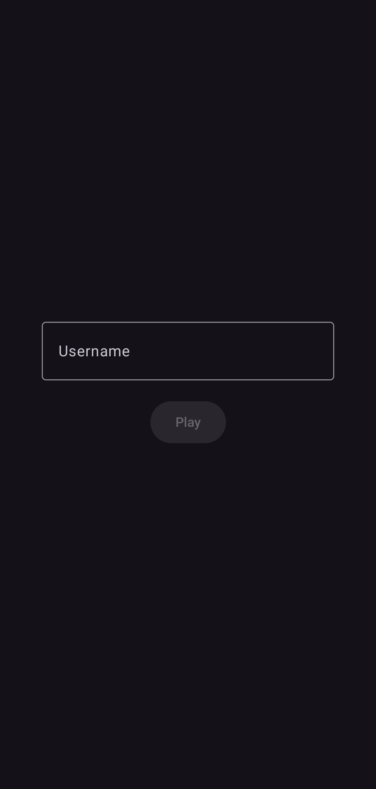
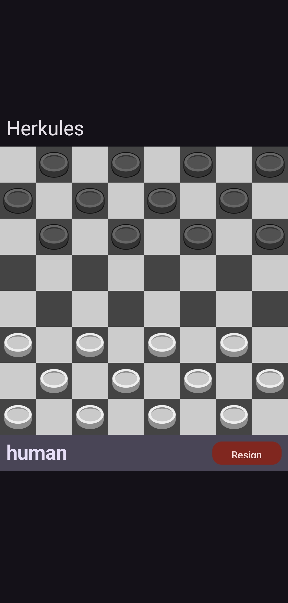
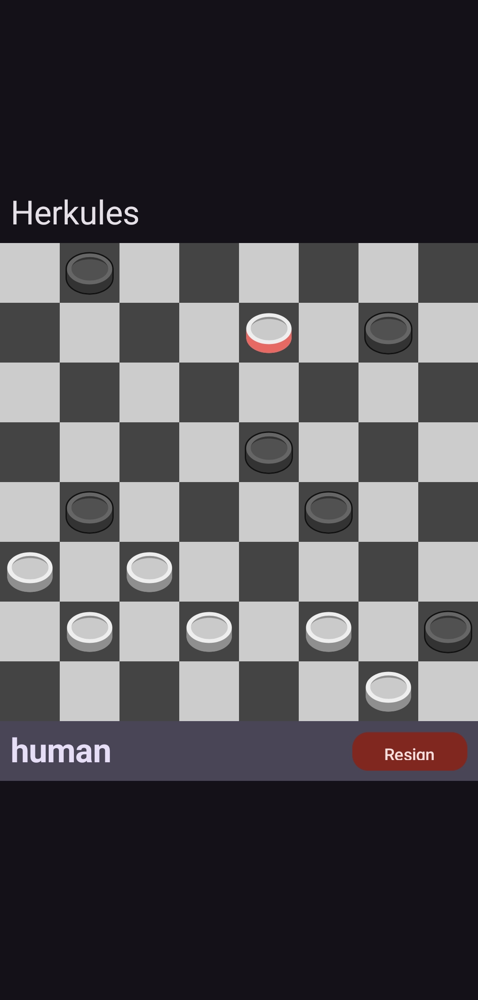
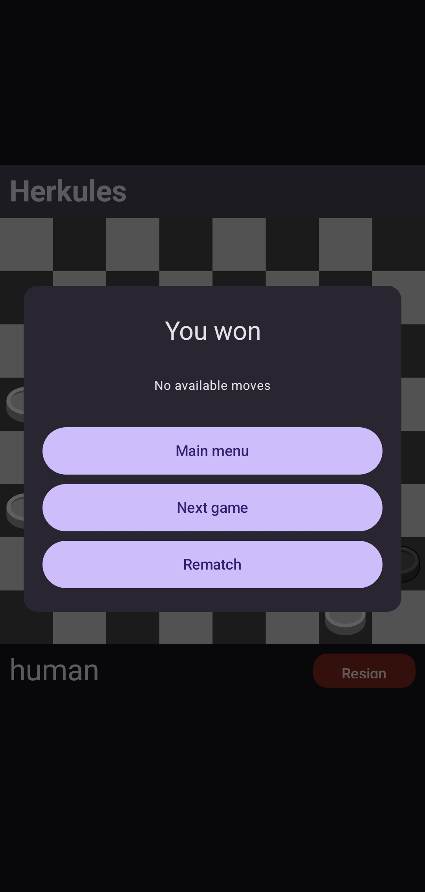

# Checkers Online

An online checkers project built by a two-person team.

The result is a complete multiplayer checkers experience with:

- real-time player-vs-player matches,
- a WebSocket-based game protocol,
- automatic matchmaking,
- rematch / resign / leave flows,
- possible-move hints,
- and a separate **bot service** that can join the queue when no second human
  player is available.

______________________________________________________________________

## Project Overview

This repository combines three main parts:

- **Backend** – a Spring Boot application responsible for game rules, move
  validation, matchmaking, and WebSocket communication.
- **Client** – a Kotlin application with shared UI/application logic organized
  in a Compose-style multiplatform structure.
- **Bot service** – a Python + FastAPI service that starts a bot player which
  connects to the same WebSocket server as a regular player.

The backend is event-driven: the client communicates with the server through a
typed WebSocket message protocol, while the server keeps track of the current
game, validates moves, broadcasts updates, and handles end-of-game conditions.

______________________________________________________________________

## Preview

|             Main Menu             |             Game Start             |
| :-------------------------------: | :--------------------------------: |
|        |  |
|        **King Promotion**         |            **Game End**            |
|  |           |

______________________________________________________________________

## Features

### Real-time multiplayer gameplay

- live game communication over WebSockets,
- matchmaking queue for pairing players,
- synchronized game state between both players,
- color assignment for each session,
- server-side move validation.

### Checkers game engine

- board initialization and game creation,
- legal move generation,
- capture handling,
- multi-capture continuation,
- promotion to kings,
- end-game detection.

### Extra gameplay flows

- request / accept / decline rematch,
- resign from a running match,
- leave queue,
- leave ongoing game,
- ask server for possible moves for a selected piece.

### Bot integration

- a separate FastAPI endpoint can start a bot session,
- the bot joins the regular WebSocket queue like any other player,
- bot decisions are generated by a minimax-based engine with alpha-beta pruning.

### Engineering aspects

- split backend / frontend / bot architecture,
- AsyncAPI description for the WebSocket protocol,
- GitHub Actions workflows for Java build and Python tests,
- clean separation between handlers, services, message DTOs, and game logic.

______________________________________________________________________

## Architecture

### 1. Spring Boot backend

The backend is the core of the system.

Its responsibilities include:

- creating and storing game sessions,
- validating moves and applying board updates,
- keeping track of active WebSocket sessions,
- pairing players from the waiting queue,
- broadcasting game events,
- handling reconnect-related session cleanup,
- exposing HTTP endpoints for creating and reading games.

The backend is organized into several areas:

- `config` – application and WebSocket configuration,
- `game` – rules, validation, board management, game service,
- `message` – request / response message models,
- `sockets` – WebSocket handler, message mapping, event handlers,
- `web` – REST controller,
- `data` – game state and piece models.

### 2. Kotlin client

The client is written in Kotlin and organized around a Compose-based project
structure.

From the repository structure, the app contains:

- shared code in `commonMain`,
- Android-specific code in `androidMain`,
- Compose UI dependencies,
- navigation, serialization, Ktor, and dependency injection libraries.

This keeps the UI/application layer clearly separated from the backend protocol
and makes the project easy to evolve further.

### 3. Python bot service

The bot is implemented as a separate Python service.

Instead of being embedded inside the Java backend, it acts as an external
participant:

1. FastAPI exposes an endpoint that starts a bot session.
1. The bot opens a WebSocket connection to the same `/ws` endpoint used by
   clients.
1. It sends `joinQueue` and waits to be matched.
1. During the match, it reacts to game events and sends moves back through the
   same protocol.

This is a neat design because the bot behaves like a normal player and does not
require any special “bot-only” game mode inside the main server.

______________________________________________________________________

## Repository Structure

```text
checkers-online/
├── backend/
│   ├── src/main/java/pw/checkers/
│   │   ├── config/
│   │   ├── data/
│   │   ├── game/
│   │   ├── message/
│   │   ├── sockets/
│   │   ├── utils/
│   │   └── web/
│   ├── src/main/resources/
│   │   ├── application.properties
│   │   ├── application-dev.properties
│   │   └── asyncapi.yaml
│   └── bot/
│       ├── server.py
│       ├── bot.py
│       ├── bot_session.py
│       └── requirements.txt
├── frontend/
│   └── composeApp/
│       └── src/
│           ├── commonMain/
│           └── androidMain/
└── .github/workflows/
```

______________________________________________________________________

## Tech Stack

### Backend

- **Java 21**
- **Spring Boot 3**
- **Spring WebSocket**
- **Spring Web**
- **Springdoc OpenAPI**
- **MapStruct**
- **Lombok**

### Frontend

- **Kotlin**
- **Jetpack Compose / Compose Multiplatform-style structure**
- **Ktor**
- **Koin**
- **kotlinx.serialization**

### Bot service

- **Python**
- **FastAPI**
- **websockets**
- **asyncio**

______________________________________________________________________

## How the Gameplay Flow Works

### Matchmaking

1. A player connects to the WebSocket server.
1. The client sends a `joinQueue` message.
1. If another player is already waiting, the server creates a new game and
   assigns colors.
1. If not, the player receives a waiting message.
1. Optionally, a bot can be started and join the same queue.

### During the game

- players send move messages through WebSocket,
- the backend validates the move,
- the board state is updated on the server,
- both players receive the result,
- if another capture is mandatory, the same piece continues,
- the game ends when one side loses by position, material, or resignation.

### After the game

Players can:

- request a rematch,
- accept or decline a rematch,
- leave the game,
- start a new queue session.

______________________________________________________________________

## WebSocket Protocol

The project contains an `asyncapi.yaml` specification describing the WebSocket
message protocol.

### Client → Server messages

- `joinQueue`
- `leaveQueue`
- `move`
- `possibilities`
- `rematchRequest`
- `acceptRematch`
- `declineRematch`
- `leave`
- `resign`

### Server → Client messages

- `gameCreated`
- `move`
- `possibilities`
- `waiting`
- `gameEnd`
- `rematchRequest`
- `error`
- `rejection`

This makes the protocol explicit and easier to document, test, and extend.

______________________________________________________________________

## REST Endpoints

Besides WebSockets, the backend also exposes REST endpoints for working with
game state:

- `POST /game` – create a new game,
- `GET /game/{gameId}` – retrieve game state by id.

The WebSocket endpoint is available at:

- `/ws`

______________________________________________________________________

## Running the Project Locally

## 1. Start the backend

From the `backend` directory:

```bash
./mvnw spring-boot:run
```

Or with system Maven:

```bash
mvn spring-boot:run
```

By default, the backend uses an in-memory H2 database.

______________________________________________________________________

## 2. Start the bot service

From the `backend` directory:

```bash
pip install -r bot/requirements.txt
uvicorn bot.server:app --reload
```

The bot service exposes:

```text
GET /play
```

Calling this endpoint starts a bot session that connects to the WebSocket
server.

______________________________________________________________________

## 3. Run the Kotlin client

Open the `frontend` project in Android Studio / IntelliJ IDEA and run the client
application from the Compose app module.

The project reads `serverAddress` from `local.properties` and falls back to
`localhost:8080` if it is not set.

Example:

```properties
serverAddress=10.0.2.2:8080
```

This is useful when running the Android app on an emulator while the backend
runs on the host machine.

______________________________________________________________________

## Possible Future Improvements

- authentication and player accounts,
- persistent match history,
- ranking / ELO system,
- reconnect support,
- spectator mode,
- chat during matches,
- stronger or configurable bot difficulty,
- Docker-based local orchestration,
- deployment configuration for production.
